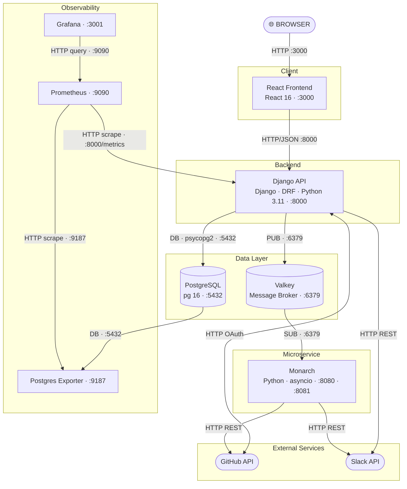

# System Map AI Prompts

## 1. Describe the System

⏺                       ┌────────────────────────────────────┐
                        │              BROWSER                │
                        └──────────────────┬─────────────────┘
                                           │ HTTP :3000
                                           ▼
                                ┌──────────────────────┐
                                │   React Frontend     │
                                │    [React 16]        │
                                │       :3000          │
                                └──────────┬───────────┘
                                           │ HTTP/JSON :8000
                                           ▼
         ┌─────────────┐  HTTP   ┌─────────────────────────────┐   HTTP   ┌─────────────┐
         │  GitHub API │◀───────│          Django API          │─────────▶│  Slack API  │
         │  (external) │───────▶│  [Django · DRF · Py 3.11]   │          │  (external) │
         └─────────────┘  OAuth │             :8000            │          └─────────────┘
                                └──────┬──────────────┬─────────┘
                                       │              │
                            DB :5432   │   PUB :6379  │
                                       ▼              ▼
                            ┌──────────────┐    ┌────────────────┐
                            │  PostgreSQL  │    │     Valkey     │
                            │   [pg 16]    │    │     :6379      │
                            │    :5432     │    └───────┬────────┘
                            └──────┬───────┘            │ SUB :6379
                                   │                    ▼
                                   │         ┌──────────────────────┐   HTTP   ┌─────────────┐
                                   │         │       Monarch        │─────────▶│  GitHub API │
                                   │         │  [Python · asyncio]  │   HTTP   │  (external) │
                                   │         │   :8080  ·  :8081    │─────────▶│  Slack API  │
                                   │         └──────────────────────┘          │  (external) │
                                   │                                            └─────────────┘
                                   │ DB :5432
                                   ▼
                            ┌──────────────────┐
                            │Postgres Exporter │
                            │      :9187       │
                            └──────────┬───────┘
                                       │ HTTP scrape :9187
                                       ▼
                            ┌──────────────────┐
                            │   Prometheus     │◀─── HTTP scrape :8000/metrics ── Django API
                            │     :9090        │
                            └──────────┬───────┘
                                       │ HTTP query :9090
                                       ▼
                            ┌──────────────────┐
                            │     Grafana      │
                            │      :3001       │
                            └──────────────────┘

## 2. Convert to a Mermaid Diagram

